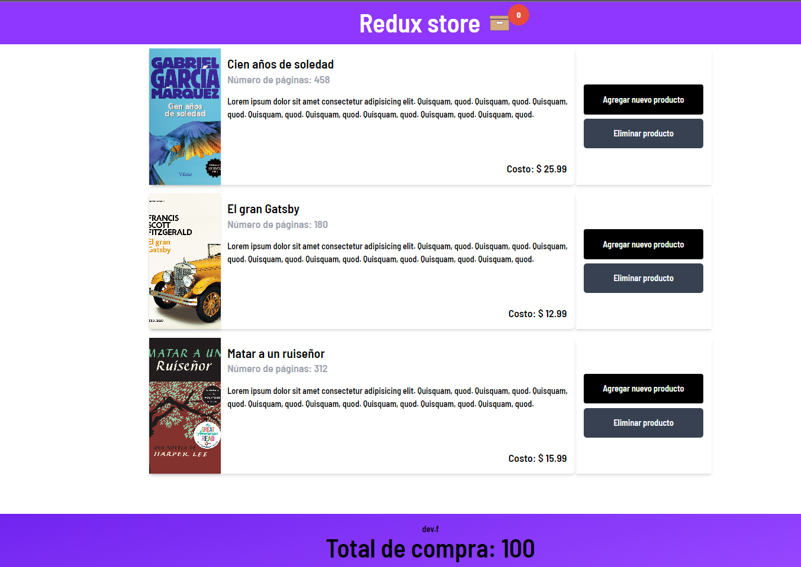

### CLASE DE REDUX

Bienvenido al proyecto de aprendizaje de Redux! Este proyecto está construido con Vite, una herramienta de desarrollo rápido para React, y utiliza la librería Redux para manejar el estado global de la aplicación.

Redux es un patrón de diseño de aplicaciones JavaScript que ayuda a desarrolladores a construir aplicaciones escalables y fáciles de mantener. Utiliza un almacén único para el estado de la aplicación y reglas claras para actualizar ese estado a través de acciones y reductores. Esto permite un mejor control y depuración del estado de la aplicación y facilita la resolución de problemas.

En este proyecto, se mostrarán ejemplos prácticos de cómo implementar Redux en una aplicación React. Aprenderás a crear un almacén, acciones y reductores, y cómo conectar tu componentes de React con el almacén de Redux.

Para comenzar, asegúrate de tener Node.js y npm instalados en tu computadora. Luego, clona este repositorio y ejecuta npm install para instalar las dependencias del proyecto. Finalmente, ejecuta npm run dev para iniciar el servidor de desarrollo y ver la aplicación en acción.

¡Empecemos a aprender Redux juntos! Si tienes alguna pregunta o encuentras algún problema, no dudes en abrir un problema en este repositorio.

---

---

###[Sitio oficial](https://redux.js.org/)

###[Documentación](https://redux.js.org/introduction/getting-started)

---
Es un conjunto de patrones para tratrar el estado de la aplicación
son palabras claves que se usan para definir el comportamiento de la aplicación
REDUCER: es una función que recibe el estado actual y una acción y devuelve el nuevo estado

STORE: es el objeto que contiene el estado de la aplicación

ACTION: es un objeto que describe qué pasó
DISPATCH: es la función que ejecuta la acción
=> REDUX SOCKET.IO <= CHAT TIEMPO REAL
SUBSCRIBE: es la función que se ejecuta cada vez que el estado cambia